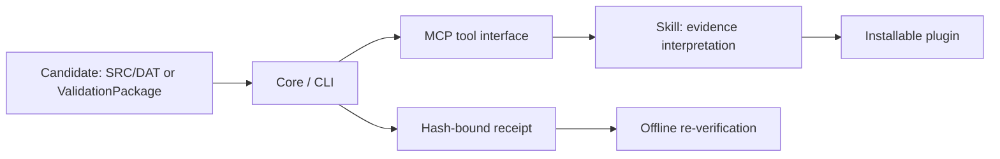

# kuka-validation-lab

[简体中文](README.zh-CN.md)

Turn an LLM agent's claim that “I verified this with an external tool” into hash-bound evidence that another process can verify offline. This repository demonstrates an agent verification pattern: preserve the exact candidate, record the scope and outcome of a check, then re-verify the receipt before accepting the claim. KUKA is the first reference adapter. A receipt establishes the integrity and recorded scope of evidence; a hash alone does not authenticate a tool or prove that execution occurred.

The pinned importer snapshot is buildable with the .NET SDK version in `global.json`; vendor-dependent paths remain opt-in.

## Architecture



The diagram shows the implementation layers. An agent uses the plugin and skill to call MCP tools, which invoke Core/CLI checks. Execution claims must remain bound to the exact candidate, environment and recorded outcome. Static readiness, simulated execution and native KSS execution are separate claims.

## Choose your capability tier

| Tier | You provide | Intended capabilities | Claim boundary |
| --- | --- | --- | --- |
| 1 — Files only | Development runtimes documented by the verified quickstart; no KUKA commercial software | Raw-KRL intake, hashing, file-chain receipt verification, ValidationPackage verification, static preflight | File integrity and static findings; no vendor execution |
| 2 — KUKA.Sim | Your own licensed KUKA.Sim 4.10 environment and required compatible assets | Bounded simulation execution and receipt verification | Simulation evidence for the exact candidate; not native KSS |
| 3 — Native KSS | Your own OfficeLite, WorkVisual and VMware environment, with required licenses | Bounded native KSS execution in an isolated virtual environment and receipt verification | Virtual native KSS evidence; not physical robot qualification |

Exact vendor versions, assets and prerequisites will be documented after import audit. **Users supply their own commercial licenses. This repository contains no KUKA vendor binaries, license files, VM images or proprietary robot assets.** Windows release bundles will contain the project runtime and redistributable dependencies only.

## Quickstart — no KUKA software

```powershell
dotnet run --project src/KukaLab.Cli -- krl candidate-intake --source samples/raw-krl --output .local/receipt.json
dotnet run --project src/KukaLab.Cli -- receipt verify --receipt .local/receipt.json
```

This verifies intake, exact SRC/DAT hashes and receipt integrity. It does not claim static readiness or vendor execution.

## Repository ownership

| Owner | Paths |
| --- | --- |
| Handwritten | `README.md`, `README.zh-CN.md`, `LICENSE`, `SECURITY.md`, `CONTRIBUTING.md`, `AGENTS.md`, `.gitignore`, `.gitattributes`, `.github/`, `docs/playbook/`, `samples/`, `scripts/import-from-lab.mjs` |
| Importer only | `src/`, `tests/`, `tools/`, `plugins/`, `IMPORT_MANIFEST.json` |

See [contributing](CONTRIBUTING.md) for the pinned refresh contract and [the playbook](docs/playbook/README.md) for source-audited lessons.

## Tests and releases

CI runs pure-logic C# tests and synthetic Node checks without vendor software. Tests requiring KUKA.Sim, OfficeLite, WorkVisual or VMware remain environment-gated.

The tag-triggered Windows workflow builds the CLI and packages it with the plugin; publishing occurs only when a maintainer pushes a version tag.

## Scope and security

No physical-controller operations are in scope. `NotRun`, `Blocked`, `Unsupported`, `Cancelled` and `Inconclusive` must never be presented as successful execution. Generalizing the evidence core is frozen until a second real domain adapter exists; no speculative framework extraction is planned.

See [security](SECURITY.md). Project-authored material is provided under the [MIT license](LICENSE); third-party material retains its applicable license.
