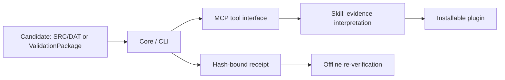

# kuka-validation-lab — verifiable evidence for LLM agents

[](https://github.com/jackxxh/kuka-validation-lab/actions/workflows/ci.yml) [](LICENSE)

[简体中文](README.zh-CN.md)

When an agent says “I verified this with an external tool”, this project turns that claim into a receipt another process can verify offline. The chain preserves the exact candidate bytes, hashes every input, records the check outcome, and rejects tampered receipts. KUKA is the reference adapter; the evidence pattern is the product.

**Try it in two commands:**

```powershell
dotnet run --project src/KukaLab.Cli -- krl candidate-intake --source samples/raw-krl --output .local/receipt.json
dotnet run --project src/KukaLab.Cli -- receipt verify --receipt .local/receipt.json
```

The first command emits a receipt for the synthetic `DEMO.SRC`/`DEMO.DAT` pair. The second recomputes the receipt hash and reports `succeeded: true`. Edit either file and repeat the commands to see the candidate identity change. This demo proves file integrity and pairing only; it does not claim robot execution or safety.

**Why this exists:** an agent can say “the simulator passed” while giving you no replayable evidence. This project makes the evidence object inspectable, hash-bound and fail-closed. Start with [the file-only example](samples/README.md), then read the [playbook](docs/playbook/README.md) before enabling vendor adapters.

The pinned importer snapshot is buildable with the .NET SDK version in `global.json`; vendor-dependent paths remain opt-in.

## Architecture



The diagram shows the implementation layers. An agent uses the plugin and skill to call MCP tools, which invoke Core/CLI checks. Execution claims must remain bound to the exact candidate, environment and recorded outcome. Static readiness, simulated execution and native KSS execution are separate claims.

## Choose your capability tier

| Tier | You provide | Intended capabilities | Claim boundary |
| --- | --- | --- | --- |
| 1 — Files only | Development runtimes documented by the verified quickstart; no KUKA commercial software | Raw-KRL intake, hashing, file-chain receipt verification, ValidationPackage verification, static preflight | File integrity and static findings; no vendor execution |
| 2 — KUKA.Sim | Your own licensed KUKA.Sim 4.10 environment and required compatible assets | Bounded simulation execution and receipt verification | Simulation evidence for the exact candidate; not native KSS |
| 3 — Native KSS | Your own OfficeLite, WorkVisual and VMware environment, with required licenses | Bounded native KSS execution in an isolated virtual environment and receipt verification | Virtual native KSS evidence; not physical robot qualification |

Exact vendor versions, assets and prerequisites will be documented after import audit. **Users supply their own commercial licenses. This repository contains no KUKA vendor binaries, license files, VM images or proprietary robot assets.** Windows release bundles will contain the project runtime and redistributable dependencies only.

## Quickstart — no KUKA software

The two commands above are the complete file-only path. Install the SDK version in `global.json`, then run them from a clean checkout. No KUKA software, license or network service is needed.

## Repository ownership

| Owner | Paths |
| --- | --- |
| Handwritten | `README.md`, `README.zh-CN.md`, `LICENSE`, `SECURITY.md`, `CONTRIBUTING.md`, `AGENTS.md`, `.gitignore`, `.gitattributes`, `.github/`, `docs/playbook/`, `samples/`, `scripts/import-from-lab.mjs` |
| Importer only | `src/`, `tests/`, `tools/`, `plugins/`, `IMPORT_MANIFEST.json` |

See [contributing](CONTRIBUTING.md) for the pinned refresh contract and [the playbook](docs/playbook/README.md) for source-audited lessons.


## Tests and releases

CI runs pure-logic C# tests and synthetic Node checks without vendor software. Tests requiring KUKA.Sim, OfficeLite, WorkVisual or VMware remain environment-gated.

The tag-triggered Windows workflow builds the CLI and packages it with the plugin; publishing occurs only when a maintainer pushes a version tag.

## Scope and security

No physical-controller operations are in scope. `NotRun`, `Blocked`, `Unsupported`, `Cancelled` and `Inconclusive` must never be presented as successful execution. Generalizing the evidence core is frozen until a second real domain adapter exists; no speculative framework extraction is planned.

See [security](SECURITY.md). Project-authored material is provided under the [MIT license](LICENSE); third-party material retains its applicable license.

Configure a machine with [an environment profile](docs/profile-guide.md) before using a vendor adapter. See the [integration matrix](docs/integration-matrix.md) for single-software, paired-software, and AI client use.
