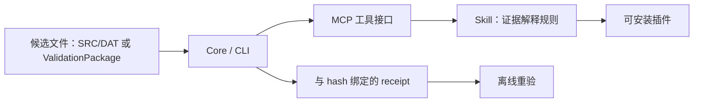

# kuka-validation-lab

[English](README.md)

把 LLM agent 的“我用外部工具验证过了”变成可离线重验、与文件 hash 绑定的证据。本仓库展示一种约束 agent 验证幻觉的模式：保留候选文件的精确字节，记录检查的范围与结果，在接受声明前重新验证 receipt。KUKA 是第一个参考适配器。Receipt 证明的是证据的完整性及其记录范围；仅有 hash 不能认证工具身份，也不能证明执行确实发生。

当前 pinned 快照可由 `global.json` 指定的 .NET SDK 构建；供应商相关路径仍需用户自备环境。

## 架构



图中展示实现层次。Agent 通过插件与 skill 调用 MCP 工具，再由 Core/CLI 执行检查。执行结论必须绑定精确候选文件、环境与记录结果；静态就绪、仿真执行、native KSS 执行分别表达。

## 三档能力

| 档位 | 用户自备条件 | 目标能力 | 结论边界 |
| --- | --- | --- | --- |
| 1：仅文件 | 经验证的 quickstart 所列开发运行时；无需 KUKA 商业软件 | raw-KRL intake、hash、文件链 receipt verify、ValidationPackage verify、静态 preflight | 文件完整性与静态检查；不代表供应商工具执行 |
| 2：KUKA.Sim | 自有授权的 KUKA.Sim 4.10 环境与所需兼容资产 | 有界仿真执行及 receipt 重验 | 精确候选文件的仿真证据；不代表 native KSS |
| 3：Native KSS | 自备 OfficeLite、WorkVisual、VMware 环境及所需授权 | 隔离虚拟环境内的有界 native KSS 执行及 receipt 重验 | 虚拟 native KSS 证据；不代表实体机器人合格 |

精确版本、资产与运行前置条件将在导入审计后注明。**用户自行提供商业授权；本仓库不包含任何 KUKA 厂商二进制、许可证文件、虚拟机镜像或专有机器人资产。** Windows 发布包只捆绑本项目运行时及允许再分发的依赖。

## Quickstart：无需 KUKA 软件

```powershell
dotnet run --project src/KukaLab.Cli -- krl candidate-intake --source samples/raw-krl --output .local/receipt.json
dotnet run --project src/KukaLab.Cli -- receipt verify --receipt .local/receipt.json
```

上述命令只验证文件 hash 与 receipt 完整性，不代表静态就绪或供应商工具执行。

## 目录所有权

| Owner | 路径 |
| --- | --- |
| 手写区 | `README.md`、`README.zh-CN.md`、`LICENSE`、`SECURITY.md`、`CONTRIBUTING.md`、`AGENTS.md`、`.gitignore`、`.gitattributes`、`.github/`、`docs/playbook/`、`samples/`、`scripts/import-from-lab.mjs` |
| 仅导入脚本生成 | `src/`、`tests/`、`tools/`、`plugins/`、`IMPORT_MANIFEST.json` |

刷新契约见 [CONTRIBUTING](CONTRIBUTING.md)，源文档经验提炼见 [playbook](docs/playbook/README.md)。

## 测试与发布

CI 将仅运行 Node 合成包 MCP 测试与 C# 纯逻辑测试，无需供应商软件。依赖 KUKA.Sim、OfficeLite、WorkVisual、VMware 的测试保留，并在未启用对应环境条件时显式跳过。精确跳过清单将在测试审计后公布，目前尚未建立。

tag 触发的 Windows workflow 会现场构建 CLI 并与插件一起打包；只有维护者推送版本 tag 时才会发布。

## 范围与安全

不涉及实体控制器操作。不得把 `NotRun`、`Blocked`、`Unsupported`、`Cancelled`、`Inconclusive` 表达为执行成功。在第二个真实领域适配器出现前冻结通用证据内核抽取，不做预测性框架重构。

安全规则见 [SECURITY](SECURITY.md)。本项目原创内容使用 [MIT](LICENSE) 许可；第三方材料保留各自适用的许可。
